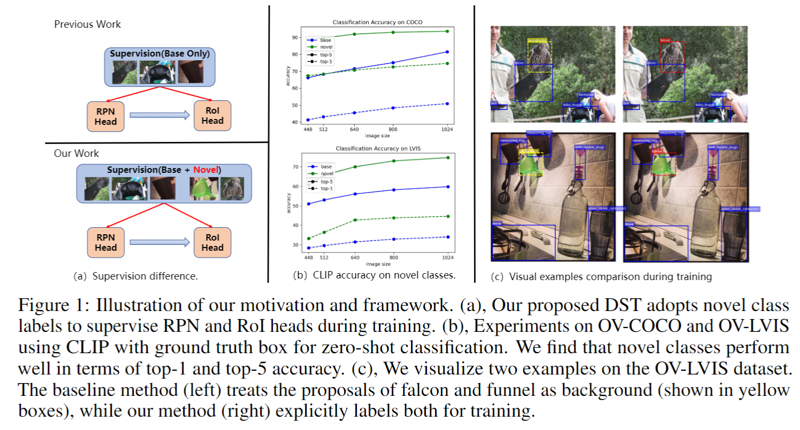

<!-- # DST-Det -->

<br />
<p align="center">
  <h1 align="center">DST-Det: Simple Dynamic Self-Training for Open-Vocabulary Object Detection</h1>
  <p align="center">
    <br />
    <a href="https://xushilin1.github.io/"><strong>Shilin Xu*</strong></a>
    ·
    <a href="https://lxtgh.github.io/"><strong>Xiangtai Li*</strong></a>
    ·
    <a href="https://wusize.github.io/"><strong>Size Wu</strong></a>
    ·
    <a href="http://zhangwenwei.cn/"><strong>Wenwei Zhang</strong></a>
    ·
    <a href="https://scholar.google.com.hk/citations?user=y_cp1sUAAAAJ&hl=en"><strong>Yining Li</strong></a>
    ·
    <a href="https://chenkai.site/"><strong>Kai Chen</strong></a>
    ·
    <a href="https://sites.google.com/view/guangliangcheng"><strong>Guangliang Cheng</strong></a>
    <br />
    <a href="https://scholar.google.com/citations?user=T4gqdPkAAAAJ&hl=zh-CN"><strong>Yunhai Tong</strong></a>
    .
    <a href="https://www.mmlab-ntu.com/person/ccloy/"><strong>Chen Change Loy</strong></a>
  </p>

<br />


See [[Project Page](https:xushilin1.github.io/dst-det)] For the detailed results for the comparison.


## Abstract

This paper presents a novel method for open-vocabulary object detection (OVOD) that aims to detect objects \textit{beyond} the set of categories observed during training. 
Our approach proposes a dynamic self-training strategy that leverages the zero-shot classification capabilities of pre-trained vision-language models, such as CLIP, to classify proposals as novel classes directly. Unlike previous works that ignore novel classes during training and rely solely on the region proposal network (RPN) for novel object detection, our method selectively filters proposals based on specific design criteria. The resulting set of identified proposals serves as pseudo labels for novel classes during the training phase, enabling our self-training strategy to improve the recall and accuracy of novel classes in a self-training manner without requiring additional annotations or datasets. Empirical evaluations on the LVIS and COCO datasets demonstrate significant improvements over the baseline performance without incurring additional parameters or computational costs during inference. Notably, our method achieves a 1.7\% improvement over the previous F-VLM method on the LVIS validation set. Moreover, combined with offline pseudo label generation, our method improves the strong baselines over 10 \% mAP on COCO. 


## Installation
The detection framework is built upon MMDetection2.x. To install MMDetection2.x, run
```
git clone https://github.com/open-mmlab/mmcv.git
cd mmcv
git checkout v1.7.0
MMCV_WITH_OPS=1 pip install -e . -v
git clone https://github.com/open-mmlab/mmdetection.git
cd mmdetection
git checkout v2.28.1
pip install -e . -v
```
This project uses `EVA-CLIP`, so run the following command to install the package
```
pip install -v -U git+https://github.com/facebookresearch/xformers.git@main#egg=xformers
pip install -e . -v
```

## Data Preparation
We conduct experiments on [COCO](https://cocodataset.org/#home) and [LVIS](https://www.lvisdataset.org/) datasets. We provide some preprocessed json files in
[Driver](https://drive.google.com/drive/folders/19Ez8zL1cycP1FeQPpSsqCVsgsRPREQRg).
```
├── data
│  │── coco
│      ├── annotations
│      ├── ├── instances_train2017.json
|      |   ├── panoptic_train2017.json
|      |   ├── panoptic_train2017
│      ├── train2017
│      ├── val2017
│      ├── zero-shot # obtain the files from the drive
│          ├── instances_val2017_all_2.json
│├── lvis_v1
│    ├── annotations
│        ├── lvis_v1_train_seen_1203_cat.json  # obtain the files from the drive 
│        ├── lvis_v1_val.json 
│    ├── train2017    # the same with coco
│    ├── val2017      # the same with coco
```
## Train
Please download the pretrained model from [here](https://drive.google.com/drive/folders/1APWIE7M5zcymbjh5OONqXdBOxFy3Ghwm). And they can be organized as follows:
```
checkpoints
    ├── eva_vitb16_coco_clipself_proposals.pt 
    ├── eva_vitl14_coco_clipself_proposals.pt
```
Run the command below to train the model.
```
bash tools/dist_train.sh  configs/fvit/coco/fvit_vitl14_upsample_fpn_bs64_3e_ovcoco_eva_original.py $NUM_GPUS

```
## Inference
Please download the checkpoints file from 🤗[Hugging Face](https://huggingface.co/shilinxu/dst-det) and use the following command to reproduce our results.
```
bash tools/dist_test.sh  configs/fvit/coco/fvit_vitl14_upsample_fpn_bs64_3e_ovcoco_eva_original.py $CKPT 8 --eval bbox

```

## Visualization Results
### COCO
<details open>
<summary>Demo</summary>

 


## Citation
If you think DST-Det is helpful in your research, please consider referring DST-Det:
```bibtex
@article{xu2023dst,
  title={DST-Det: Simple Dynamic Self-Training for Open-Vocabulary Object Detection},
  author={Xu, Shilin and Li, Xiangtai and Wu, Size and Zhang, Wenwei and Li, Yining and Cheng, Guangliang and Tong, Yunhai and Chen, Kai and Loy, Chen Change},
  journal={arXiv preprint arXiv:2310.01393},
  year={2023}
}
```

## License
MIT license

## Acknowledgement
We thank [MMDetection](https://github.com/open-mmlab/mmdetection), [open-clip](https://github.com/mlfoundations/open_clip), [CLIPSelf](https://github.com/wusize/CLIPSelf) for their valuable code bases.
